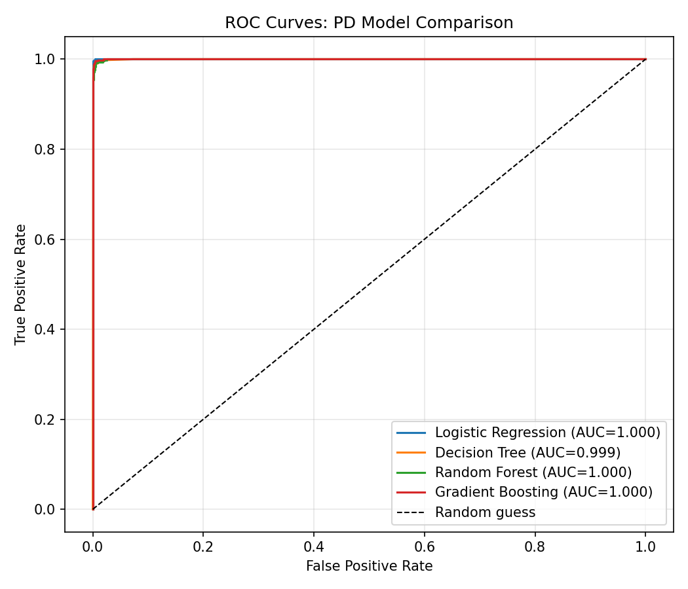

# Loan Default (PD) Model & Expected Loss

Part of a JPMorgan Chase Quantitative Research job simulation.

Trains and compares 4 classifiers on a 10,000-row loan book to predict a
borrower's probability of default (PD), then computes **expected loss** on
any loan: `PD × exposure at default × (1 − recovery rate)`, with a 10%
recovery rate assumption.

## Run it

```bash
pip install -r requirements.txt
python pd_model.py
```

## Model comparison (held-out test set)

| Model | AUC | Accuracy | Precision | Recall | F1 |
|---|---|---|---|---|---|
| Logistic Regression | 1.0000 | 0.9984 | 1.0000 | 0.9914 | 0.9957 |
| Decision Tree | 0.9992 | 0.9960 | 0.9913 | 0.9870 | 0.9892 |
| Random Forest | 0.9997 | 0.9928 | 0.9847 | 0.9762 | 0.9805 |
| Gradient Boosting | 0.9999 | 0.9960 | 0.9871 | 0.9914 | 0.9892 |



## Sample output

```
PD=0.000  loan_amt=$5,000  -> Expected Loss = $0.00
PD=1.000  loan_amt=$8,000  -> Expected Loss = $7,199.97
PD=0.003  loan_amt=$6,000  -> Expected Loss = $14.07
```

## Usage

```python
from pd_model import expected_loss

expected_loss(
    credit_lines_outstanding=2, loan_amt_outstanding=10000,
    total_debt_outstanding=7000, income=55000,
    years_employed=4, fico_score=650,
)
```

**Note:** this AUC is unusually high because the sample dataset is
synthetic with a fairly clean underlying relationship between features and
default. Real production loan data is noisier — expect materially lower
AUC (~0.7–0.85 is typical for real-world PD models) once retrained on
actual production data.

## License
MIT — see `LICENSE`.
